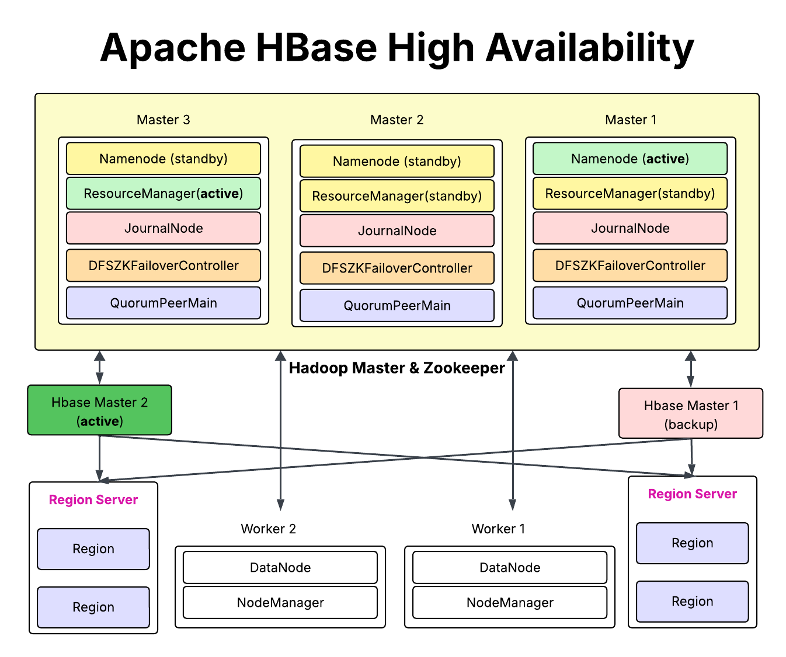

# 🏰 HadoopFortress

> **Build Your Own Fortress of Big Data**  
> A fully Dockerized Big Data ecosystem with Hadoop (HDFS & YARN), Hive, and HBase, all configured for High Availability.


---

## 📌 Overview

**HadoopFortress** is an end-to-end, containerized **Big Data Ecosystem**, designed to simulate production-grade environments on a local machine or private cloud using **Docker Compose**.

This project integrates:
- 🧱 **HDFS (High Availability)** – 3-node cluster with active-standby NameNodes
- 🧠 **YARN (High Availability)** – 3-node ResourceManager cluster with failover support
- 🗂️ **Shared Edits via JournalNodes** – ensures metadata consistency with Quorum Journal Manager
- 🐝 **Hive (High Availability)** – SQL-based data warehousing and querying engine
- 🐘 **HBase (High Availability)** – scalable, distributed NoSQL columnar database
- 🦓 **ZooKeeper** – service coordination and leader election framework
- ❤️‍🩹 **Health Monitoring** – integrated service health checks for critical components

---

## 🌐 Ecosystem Architecture



```
                        ┌─────────────────────┐
                        │    Client/Users     │
                        └────────┬────────────┘
                                 │
                 ┌───────────────▼────────────────┐
                 │         Hive (SQL on Hadoop)   │
                 └───────────────┬────────────────┘
                                 │
      ┌────────────┐      ┌──────▼──────┐       ┌────────────┐
      │   HBase     ◄─────►   HDFS     ◄───────►    YARN     │
      └─────┬───────┘      └────────────┘       └────┬───────┘
            │                                        │
    ┌───────▼────────┐                      ┌───────▼────────┐
    │ ZooKeeper      │                      │  JournalNodes  │
    └────────────────┘                      └────────────────┘
```
### Hive Architecture
```
                 ┌────────────────────────┐
                 │   Hive Clients (JDBC)  │
                 └────────────┬───────────┘
                              │
                      ┌───────▼────────┐
                      │  HiveServer2   │
                      └───────┬────────┘
                              │
                      ┌───────▼────────┐
                      │ Hive Metastore │
                      └───────┬────────┘
                              │
                    ┌────────▼─────────┐
                    │     Apache Tez   │
                    └────────┬─────────┘
                             │
                    ┌────────▼────────┐
                    │      YARN       │
                    └─────────────────┘

```

---

## 🚀 Features

✅ Full **Big Data Ecosystem** (Hadoop, HBase, Hive)  
✅ **High Availability** for NameNode using ZooKeeper & JournalNodes  
✅ **Docker-Compose Powered** – Fast setup, teardown, and portability  
✅ Pre-configured **networking, ports, and volumes**  
✅ Ideal for **learning**, **prototyping**, and **testing** data pipelines  

---

## 🛠️ Quick Start

### 1️⃣ Prerequisites
- [Docker](https://www.docker.com/)
- [Docker Compose](https://docs.docker.com/compose/)

### 2️⃣ Clone the Repository

```bash
git clone https://github.com/Ahmed-Naserelden/HadoopFortress.git
cd HadoopFortress
```

### 3️⃣ Spin Up the Cluster

```bash
docker-compose up -d
```

---

## 🔍 Accessing Services

#### NameNode

| Node       | URL                          |
|------------|------------------------------|
| Master1    | [localhost:9879](http://localhost:9879) |
| Master2    | [localhost:9880](http://localhost:9880) |
| Master3    | [localhost:9881](http://localhost:9881) |

#### ResourceManager

| Node       | URL                          |
|------------|------------------------------|
| Master1    | [localhost:8078](http://localhost:8078) |
| Master2    | [localhost:8079](http://localhost:8079) |
| Master3    | [localhost:8080](http://localhost:8080) |


#### RHBase Master

| Component            | URL                    |
|----------------------|------------------------|
| HBase Master 1 UI     | http://localhost:16010 |
| HBase Master 2 UI     | http://localhost:16011 |


| Component       | URL                          |
|----------------|------------------------------|
| HiveServer2     | JDBC: `jdbc:hive2://localhost:10000` |

---

## 📂 Folder Structure

```bash
HadoopFortress/
├── docker-compose.yml       # Main Docker stack
├── hadoop-config/           # Core Hadoop configs
├── hive/                    # Hive scripts and configs
├── hbase/                   # HBase configurations
├── zookeeper/               # ZooKeeper ensemble configs
├── Dockerfile               # Custom Hadoop base image
└── README.md
```

---

## 🧪 Test the Ecosystem

### 🔹 HDFS Test

```bash
docker exec -it <namenode-container> bash
hdfs dfs -mkdir /test
hdfs dfs -ls /
```

### 🔹 Hive Test

```bash
docker exec -it <hive-container> bash
beeline -u jdbc:hive2://localhost:10000
CREATE DATABASE demo;
SHOW DATABASES;
```

### 🔹 HBase Test

```bash
docker exec -it <hbase-container> bash
hbase shell
create 'users', 'info'
put 'users', '1', 'info:name', 'Alice'
scan 'users'
```

---

## 📚 Learn More

- [Apache Hadoop](https://hadoop.apache.org/)
- [Apache Hive](https://hive.apache.org/)
- [Apache HBase](https://hbase.apache.org/)
- [ZooKeeper](https://zookeeper.apache.org/)

---

## 🤝 Contributing

Got an idea to improve this stack?  
Feel free to fork the project, create a branch, and submit a pull request.

---

## 📄 License

This project is licensed under the MIT License.  
See the [LICENSE](LICENSE) file for details.
