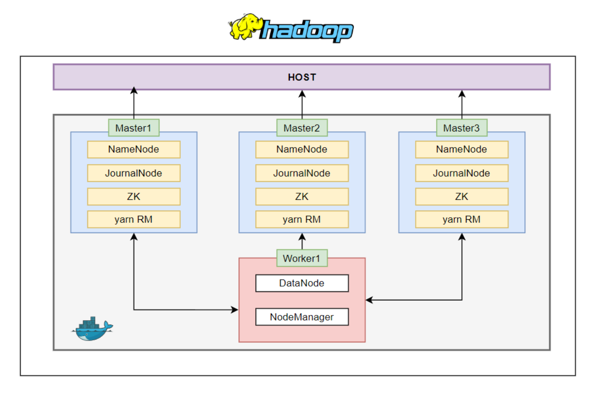

# HDFS High Availability Using the Quorum Journal Manager

### create container 
`terminal`
```bash
docker container run -it --name <container-nam> \
    --hostname hadoop \ 
    -p 8888:8888 \ 
    -p 9879:9870 \
    -p 4040:4040 \
    -p 8078:8088 \
    -p 9864:9864 \
    -p 8042:8042 \
    -p 18180:18080 \
    -p 18181:18081 \
    -v ./shared:/shared ubuntu:22.04
```

### download hadoop
`terminal`
```bash
curl -L https://dlcdn.apache.org/hadoop/common/hadoop-3.3.6/hadoop-3.3.6.tar.gz -o hadoop-3.3.6.tar.gz
```


`/etc/sysctl.conf`
```bash
net.ipv6.conf.all.disable_ipv6=1
net.ipv6.conf.default.disable_ipv6=1
net.ipv6.conf.lo.disable_ipv6=1
```

`~/.bashrc`
```bash
export JAVA_HOME=/usr/lib/jvm/java-8-openjdk-amd64
export HADOOP_HOME=/usr/local/hadoop
export PATH=$PATH:$HADOOP_HOME/bin:$HADOOP_HOME/sbin
export HADOOP_CONF_DIR=$HADOOP_HOME/etc/hadoop
```

`~/.bashrc`
```bash
export JAVA_HOME=/usr/lib/jvm/java-8-openjdk-amd64
export PATH=$JAVA_HOME/bin:$PATH
export HADOOP_HOME=/usr/local/hadoop
export HADOOP_CONF_DIR=$HADOOP_HOME/etc/hadoop
export HADOOP_MAPRED_HOME=$HADOOP_HOME
export HADOOP_COMMON_HOME=$HADOOP_HOME
export HADOOP_HDFS_HOME=$HADOOP_HOME
export YARN_HOME=$HADOOP_HOME
export PATH=$PATH:$HADOOP_HOME/bin
export PATH=$PATH:$HADOOP_HOME/sbin
export HADOOP_COMMON_LIB_NATIVE_DIR=$HADOOP_HOME/lib/native
export HADOOP_OPTS="-Djava.library.path=$HADOOP_HOME/lib"
```


`/usr/local/hadoop/etc/hadoop/hadoop-env.sh`
```bash
export HADOOP_OPTS="$HADOOP_OPTS -Djava.net.preferIPv4Stack=true"
export JAVA_HOME=/usr/lib/jvm/java-8-openjdk-amd64
export HADOOP_HOME_WARN_SUPPRESS="TRUE"
export HADOOP_ROOT_LOGGER="WARN,DRFA"
```

`/usr/local/hadoop/etc/hadoop/yarn-site.xml`
```xml
<configuration>
    <property>
        <name>yarn.nodemanager.aux-services</name>
        <value>mapreduce_shuffle</value>
    </property>
    <property>
        <name>yarn.nodemanager.aux-services.mapreduce.shuffle.class</name>
        <value>org.apache.hadoop.mapred.ShuffleHandler</value>
    </property>
</configuration>
```

`/usr/local/hadoop/etc/hadoop/hdfs-site.xml`
```xml
<configuration>
    <property>
        <name>dfs.replication</name>
        <value>1</value>
    </property>
    <property>
        <name>dfs.namenode.name.dir</name>
        <value>file:/usr/local/hadoop/yarn_data/hdfs/namenode</value>
    </property>
    <property>
        <name>dfs.datanode.data.dir</name>
        <value>file:/usr/local/hadoop/yarn_data/hdfs/datanode</value>
    </property>
</configuration>
```

`/usr/local/hadoop/etc/hadoop/core-site.xml`
```xml
<configuration>
    <property>
        <name>hadoop.tmp.dir</name>
        <value>/app/hadoop/tmp</value>
    </property>
    <property>
        <name>fs.default.name</name>
        <value>hdfs://localhost:9000</value>
    </property>
</configuration>
```

`/usr/local/hadoop/etc/hadoop/mapred-site.xml`
```xml
<configuration>
    <property>
        <name>mapreduce.framework.name</name>
        <value>yarn</value>
    </property>
    <property>
        <name>mapreduce.jobhistory.address</name>
        <value>localhost:10020</value>
    </property>
</configuration>
```

`terminal`
```bash
sudo mkdir -p /app/hadoop/tmp
sudo chmod -R 777 /app/hadoop/tmp
sudo chown -R hduser:hadoop /app/hadoop/tmp
sudo mkdir -p /usr/local/hadoop/yarn_data/hdfs/namenode
sudo mkdir -p /usr/local/hadoop/yarn_data/hdfs/datanode
sudo chmod -R 777 /usr/local/hadoop/yarn_data/hdfs/namenode
sudo chmod -R 777 /usr/local/hadoop/yarn_data/hdfs/datanode
sudo chown -R hduser:hadoop /usr/local/hadoop/yarn_data/hdfs/namenode
sudo chown -R hduser:hadoop /usr/local/hadoop/yarn_data/hdfs/datanode
```
`terminal`
```bash
source ~/.bashrc
sudo service ssh start

if [ ! -f /usr/local/hadoop/yarn_data/hdfs/namenode/formatted ]; then
    echo "Formatting HDFS Namenode..."
    $HADOOP_HOME/bin/hdfs namenode -format
    touch /usr/local/hadoop/yarn_data/hdfs/namenode/formatted
fi


echo "Starting Hadoop services..."
$HADOOP_HOME/sbin/start-dfs.sh
$HADOOP_HOME/sbin/start-yarn.sh
```


`run a container`
```bash
docker container run -d --name hadoop-cluster100 --hostname hadoop -p 8888:8888 -p 9879:9870 -p 4040:4040 -p 8078:8088 -p 9864:9864 -p 8042:8042 -p 18180:18080 -p 18181:18081 -v ./shared:/shared an2071497/hadoopimg:1.4
```

```bash
docker container run -it --name hadoop-cluster100 --hostname hadoop -p 8888:8888 -p 9879:9870 -p 4040:4040 -p 8078:8088 -p 9864:9864 -p 8042:8042 -p 18180:18080 -p 18181:18081 -v ./shared:/shared -v ./shared/master_entrypoint/entrypoint.sh:/entrypoint.sh an2071497/hadoopimg:1.6 
```


```bash
hdfs haadmin -getServiceState nn1
hdfs haadmin -getServiceState nn2
hdfs haadmin -getServiceState nn3

hdfs haadmin -getAllServiceState

hdfs haadmin -transitionToActive nn1 --forcemanual


```

```bash
PATH="$PATH:/usr/local/zookeeper/bin"
```